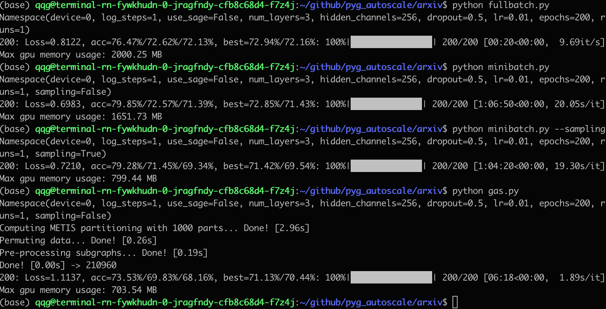

# pygas_example
使用OGBN-Arxiv数据集，尝试复现 (GASAutoScale)[https://github.com/rusty1s/pyg_autoscale/]

安装GASAutoScale
```
pip install git+https://github.com/rusty1s/pyg_autoscale.git
```

```
python fullbatch.py --root arxiv_folder
python minibatch.py --root arxiv_folder
python gas.py --root arxiv_folder
```




# 使用体验
### Pros
* 运行速度快，显存需求少

### Cons
* 1、对模型的改动比声称的要多
    - 需要增加一个成员变量 `self.out_channels`
    - 为了方便推理要增加一个函数 `forward_layer(self, layer, x, adj_t, state)`
    - 需要在forward中增加Lipschitz Continuity regularization，并return
* 2、metis算法要求输入图是无向图
* 3、batch_size的含义变为metis生成的子图个数
* 4、Lipschitz 约束不太稳定，需要调参